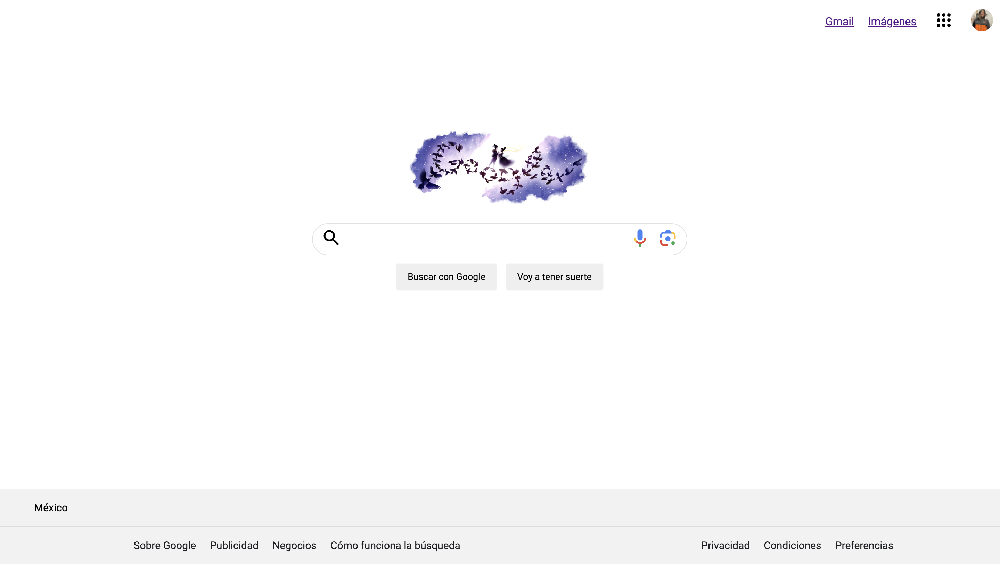

# Clon de google.

<!---
Primero va el objetivo:
-->

<!---
Indice: Objetivo, Evidencia o demostración (link a el proyecto ya en internet), Qué construimos, Tecnologías, Requisitos 
-->

<!-- 
Evidencia, capturas de pantalla, el link al proyecto.
-->

### Evidencia

[Link al proyecto: google-mali-clon.netlify.app](https://google-mali-clon.netlify.app/)

<!-- 
Descripción del proyecto, cómo se contruyó.
-->

Descripción:

<!-- 
Listan las herramientas: ej (HTML, CSS, JS, Bootstrap, Typewriter JS)
-->

<!-- 
Pasos para instalar su proyecto y correrlo o puedes agregar los créditos del proyecto.
-->

